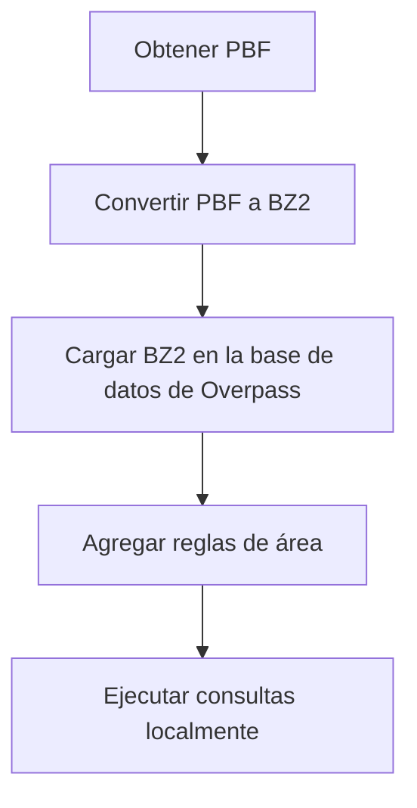

# overpass-immu-docker
> Ejecute la API Overpass localmente en Docker sin depender de los servidores públicos de Overpass.

<a href="https://img.shields.io/badge/License-MIT-blue.svg"></a>

[English](./README.md) [Français](./README.fr.md)

<a href="https://youtu.be/w6zz6BZPMak">

</a>

Este proyecto permite la consulta local de datos de OpenStreetMap (OSM) utilizando la API Overpass, eliminando la 
necesidad de depender de los servidores públicos de la API Overpass.

Los datos de OSM se obtienen como archivos `.pbf` y se convierten al formato de base de datos de Overpass, después de 
lo cual las consultas se pueden ejecutar completamente en la máquina local.

Los datos de OSM y los archivos de la base de datos se gestionan en el sistema de archivos del host y se exponen al 
contenedor a través de volúmenes de Docker, manteniendo el propio contenedor sin estado e inmutable, lo que da origen 
al nombre `overpass-immu-docker`.

**Nota:** este proyecto no incluye un mecanismo de actualización de datos de OSM. Para los casos de uso que requieren 
actualizaciones continuas de datos, se recomienda una solución alternativa.

## Características

- Todos los binarios de Overpass necesarios están empaquetados en la imagen de Docker.
- Imágenes de Docker disponibles para las arquitecturas AMD64 y ARM64.
- Los archivos de la base de datos de Overpass residen en el host utilizando volúmenes de Docker.
- Servidor HTTPD de Overpass disponible como una imagen de Docker separada.

## Arquitectura

Ningún archivo de base de datos se almacena dentro del contenedor de Docker. En cambio, todos los datos de OSM y los 
archivos de la base de datos de Overpass residen en el sistema de archivos del host y se ponen a disposición del 
contenedor a través de volúmenes de Docker.

Todas las herramientas necesarias para la conversión de datos y la consulta se incluyen en el contenedor, por lo que 
no es necesario instalar software adicional en el sistema operativo del host.

Este contenedor no incluye un mecanismo de actualización de datos de OSM. Para los casos de uso que requieren 
actualizaciones continuas, se recomienda una solución específica, como un servidor de la API Overpass con soporte de 
replicación.

El caso de uso principal es ejecutar consultas locales de Overpass contra datos de OSM, sin depender de las API 
públicas de Overpass.

## Ejecución de la canalización (Pipeline Run)

Primero, clone el repositorio y luego ejecuta el script de shell:

```bash
./run-loader.sh <país> <región>
```

Los parámetros `<país>` y `<región>` corresponden a los identificadores de región utilizados en el sitio de descarga 
de [Geofabrik](https://download.geofabrik.de/index.html).

Para países más grandes con subregiones, utilice:

```bash
./run-loader.sh <subregión> <país> <región>
```

El script descarga el archivo `.pbf` de Geofabrik y ejecuta la canalización de ingestión completa: convierte el 
archivo `.pbf` en un archivo `.bz2` y luego lo carga en el formato de base de datos de la API Overpass. Una vez 
completada correctamente, la carpeta `db` (montada a través de volúmenes de Docker) contendrá los archivos de la base 
de datos listos para las consultas de Overpass.

*Nota:* Dependiendo del tamaño del archivo de descarga y la velocidad de la computadora, todo el proceso puede llevar 
algún tiempo.

## Ejecutar una consulta

Si desea ejecutar una consulta local en la base de datos que ha creado con la ejecución de la canalización (Pipeline 
Run) anterior, ingrese el siguiente comando:

```bash
docker run --rm -it -v ./db:/opt/op/db tderflinger/oss-immu-docker /opt/op/bin/osm3s_query --db-dir=/opt/op/db
```

Luego, puede ingresar la consulta de Overpass en el campo de entrada de la terminal.

Alternativamente, si tiene la consulta de Overpass en un archivo de texto, puede hacerlo de la siguiente manera:

```bash
cat query.txt | docker run --rm -i -v ./db:/opt/op/db tderflinger/overpass-immu-docker /opt/op/bin/osm3s_query 
--db-dir=/opt/op/db
```

## Descripción general de la canalización (Pipeline Overview)

Este diagrama ilustra el proceso de carga de datos de OSM y luego la consulta de estos datos con Overpass.



## Construir el contenedor de Docker

Si desea crear la imagen de Docker localmente para las ISA AMD64 y ARM64, ejecute:

```bash
docker buildx build --platform linux/amd64,linux/arm64 -t tderflinger/overpass-immu-docker . --load
```

## API HTTP

Este proyecto también incluye el contenedor de Docker `overpass-httpd-immu`, que permite la consulta de datos de OSM 
utilizando una API HTTP.  La imagen se basa en el proyecto 
[docker-overpass](https://github.com/drolbr/docker-overpass) de Roland Olbricht.

Ejecute el script de inicio proporcionado desde el directorio local que contiene la carpeta `db` de la canalización:

```bash
./run-httpd.sh
```

Luego, puede ejecutar una consulta, por ejemplo, con curl, de la siguiente manera:

```bash
curl -sS "http://localhost:8080/api/interpreter" --data-urlencode "data@query.txt"
```

El archivo `query.txt` contiene la consulta de Overpass.

## Pruebas

Esta solución de contenedor se ha probado en un sistema ARM64 (Raspberry Pi 5) y AMD64 con Linux.
Por favor, registre un problema si tiene problemas en su sistema.

## Referencias

- API Overpass: https://github.com/drolbr/Overpass-API

- Setting up an Overpass API server - how hard can it be:  
https://www.openstreetmap.org/user/SomeoneElse/diary/408252

- docker-overpass: https://github.com/drolbr/docker-overpass

## Licencia

Este repositorio en sí mismo está licenciado como MIT.

Este proyecto contiene archivos de [docker-overpass](https://github.com/drolbr/docker-overpass) que contienen 
archivos con licencia AGPL-3.0 de [Overpass API](https://github.com/drolbr/Overpass-API). El archivo `build.sh`

Las imágenes de Docker contienen aplicaciones con licencia AGPL-3.0 de [Overpass 
API](https://github.com/drolbr/Overpass-API).

La carpeta `test` contiene datos de OSM con licencia ODbL (https://opendatacommons.org/licenses/odbl/).

