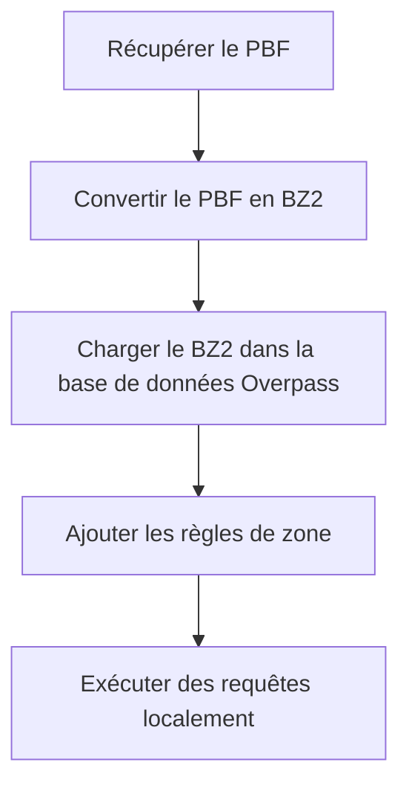

# overpass-immu-docker
> Exécutez l'API Overpass localement via Docker, sans dépendre des serveurs Overpass publics.

<a href="https://img.shields.io/badge/License-MIT-blue.svg"></a>

Ce projet permet de requêter des données OpenStreetMap (OSM) localement en utilisant l'API Overpass, éliminant ainsi le besoin de dépendre des serveurs publics de l'API Overpass.

Les données OSM sont obtenues sous forme de fichiers `.pbf` et converties au format de base de données Overpass, 
après quoi les requêtes peuvent être exécutées entièrement sur la machine locale.

Les données OSM et les fichiers de base de données sont gérés sur le système de fichiers de l'hôte et sont exposés au 
conteneur via des volumes Docker, ce qui permet de maintenir le conteneur lui-même sans état et immuable, d'où le nom 
`overpass-immu-docker`.

**Note :** ce projet ne comprend pas de mécanisme de mise à jour des données OSM. Pour les cas d'utilisation 
nécessitant des mises à jour continues des données, une solution alternative est recommandée.

## Fonctionnalités

- Tous les binaires Overpass nécessaires sont inclus dans l'image Docker.
- Des images Docker sont disponibles pour les architectures AMD64 et ARM64.
- Les fichiers de base de données Overpass résident sur l'hôte via des volumes Docker.
- Un serveur HTTPD Overpass est disponible en tant qu'image Docker distincte.

## Architecture

Aucun fichier de base de données n'est stocké dans le conteneur Docker. Au lieu de cela, toutes les données OSM et les fichiers de base de données Overpass résident sur le système de fichiers de l'hôte et sont mis à disposition du conteneur via des volumes Docker.

Tous les outils nécessaires à la conversion des données et à l'exécution de requêtes sont regroupés dans le conteneur, de sorte qu'aucun logiciel supplémentaire n'a besoin d'être installé sur le système d'exploitation de l'hôte.

Ce conteneur ne comprend pas de mécanisme de mise à jour des données OSM. Pour les cas d'utilisation nécessitant des mises à jour continues, une solution spécialement conçue, telle qu'un serveur API Overpass avec prise en charge de la réplication, est recommandée.

L'utilisation principale est l'exécution de requêtes Overpass locales sur des données OSM, sans dépendre des serveurs publics de l'API Overpass.

## Exécution de la pipeline

Clonez d'abord le dépôt, puis exécutez le script shell :

```bash
./run-loader.sh <pays> <région>
```

Les paramètres `<pays>` et `<région>` correspondent aux identifiants de région utilisés sur le site de téléchargement 
de [Geofabrik](https://download.geofabrik.de/index.html).

Pour les pays plus vastes avec des sous-régions, utilisez :

```bash
./run-loader.sh <sous-région> <pays> <région>
```

Le script télécharge le fichier `.pbf` depuis Geofabrik et exécute l'ensemble de la pipeline : il convertit le 
fichier `.pbf` en un fichier `.bz2` puis le charge dans le format de base de données de l'API Overpass. Une fois le 
processus terminé, le dossier `db` - monté via des volumes Docker - contiendra les fichiers de base de données prêts 
pour les requêtes Overpass.

*Remarque :* Selon la taille du fichier de téléchargement et la vitesse de l'ordinateur, l'ensemble du processus peut 
prendre un certain temps.

## Exécution d'une requête

Si vous souhaitez exécuter une requête locale sur la base de données que vous avez créée avec la pipeline ci-dessus, 
exécutez la commande suivante :

```bash
docker run --rm -it -v ./db:/opt/op/db tderflinger/overpass-immu-docker /opt/op/bin/osm3s_query --db-dir=/opt/op/db
```

Vous pouvez ensuite entrer la requête Overpass dans le champ d'entrée du terminal.

Alternativement, si vous avez votre requête Overpass dans un fichier texte, vous pouvez procéder comme suit :

```bash
cat query.txt | docker run --rm -i -v ./db:/opt/op/db tderflinger/overpass-immu-docker /opt/op/bin/osm3s_query 
--db-dir=/opt/op/db
```

## Aperçu de la pipeline

Ce diagramme illustre le processus de chargement des données OSM, puis de requêtage de celles-ci avec Overpass.



## Construction de l'image Docker

Si vous souhaitez créer l'image Docker localement pour les ISA AMD64 et ARM64, exécutez :

```bash
docker buildx build --platform linux/amd64,linux/arm64 -t tderflinger/overpass-immu-docker . --load
```

## API HTTP

Ce projet comprend également le conteneur Docker `overpass-httpd-immu` qui permet de requêter des données OSM via une 
API HTTP. L'image est basée sur le projet [docker-overpass](https://github.com/drolbr/docker-overpass) de Roland 
Olbricht.

Exécutez le script de démarrage fourni dans le répertoire contenant le dossier `db` provenant du script de la 
pipeline :

```bash
./run-httpd.sh
```

Vous pouvez ensuite exécuter une requête, par exemple avec curl, comme ceci :

```bash
curl -sS "http://localhost:8080/api/interpreter" --data-urlencode "data@query.txt"
```

Le fichier `query.txt` contient la requête Overpass.

## Tests

Cette solution conteneurisée a été testée sur un système ARM64 (Raspberry Pi 5) et AMD64 sous Linux.
Veuillez signaler un problème si vous rencontrez des problèmes sur votre système.

## Références

- API Overpass : https://github.com/drolbr/Overpass-API

- Mise en place d'un serveur API Overpass - est-ce si difficile : 
https://www.openstreetmap.org/user/SomeoneElse/diary/408252

- docker-overpass : https://github.com/drolbr/docker-overpass

## Licence

Ce dépôt en lui-même est sous licence MIT.

Ce projet contient des fichiers provenant de [docker-overpass](https://github.com/drolbr/docker-overpass).

Le dossier `rules` contient des fichiers sous licence AGPL-3.0 provenant de [Overpass 
API](https://github.com/drolbr/Overpass-API). Le fichier `build.sh`

Les images Docker sont sous licence AGPL-3.0 provenant de [Overpass API](https://github.com/drolbr/Overpass-API).

Le dossier `test` contient des données OSM sous licence [ODbL](https://opendatacommons.org/licenses/odbl/).
