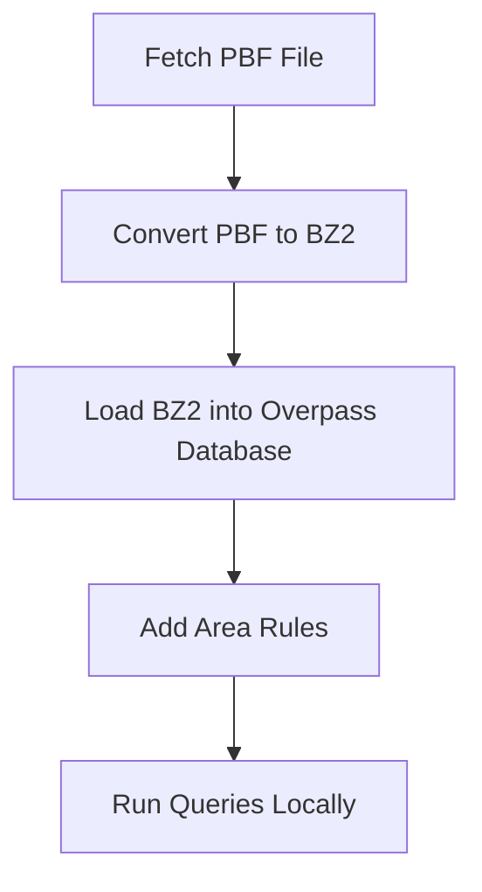

# overpass-immu-docker

This is a specialized Docker container for querying OSM using Overpass.
The use case is querying the OSM data with Overpass locally. 

Download the data you want to query as `.pbf` files and convert them to the database structure the
Overpass CLI can query. Run Overpass queries against the data locally without
relying on any public Overpass API server.

The main idea is to have the OSM data linked via Docker volumes to the Overpass application.
The docker container should be immutable (that is where the name `overpass-immu-docker` comes from).

For simplicity, there is no data update mechanism included.

## Pipeline Run

Run the shell script:

```bash
./run-loader.sh <country> <region>
```

This script gets the .pdf file from Geofabrik and then runs the
whole pipeline to first convert it to a .bz2 file and then change it to
the Overpass API own database format.
The `db` folder that is linked via Docker volumes to the local `db` folder contains after
a successful run the database files in the format Overpass API can use for subsequent queries.

## Run Query

If you want to run a local query on the database you have created with the Pipeline Run above, enter the following command:

```bash
docker run --rm -it -v ./:/opt/op tderflinger/overpass-immu-docker /opt/op/binaries/osm3s_query --db-dir=/opt/op/db
```

You can then enter the Overpass Query in the terminal input field.

## Pipeline Overview

This diagram illustrates the process of loading OSM data and then querying it
with Overpass.



## Build Docker Container

If you want to create the Docker image locally, run:

```bash
docker build -t overpass-immu-docker .
```

## References

- Overpass API: https://github.com/drolbr/Overpass-API

- Setting up an Overpass API server - how hard can it be: https://www.openstreetmap.org/user/SomeoneElse/diary/408252


## License

This repository as such is licensed as MIT.

It contains the following applications licensed as AGPL-3.0:  `binaries/osm3s_query` and `binaries/update_database` and `rules/areas.osm3s` from [Overpass API](https://github.com/drolbr/Overpass-API).
