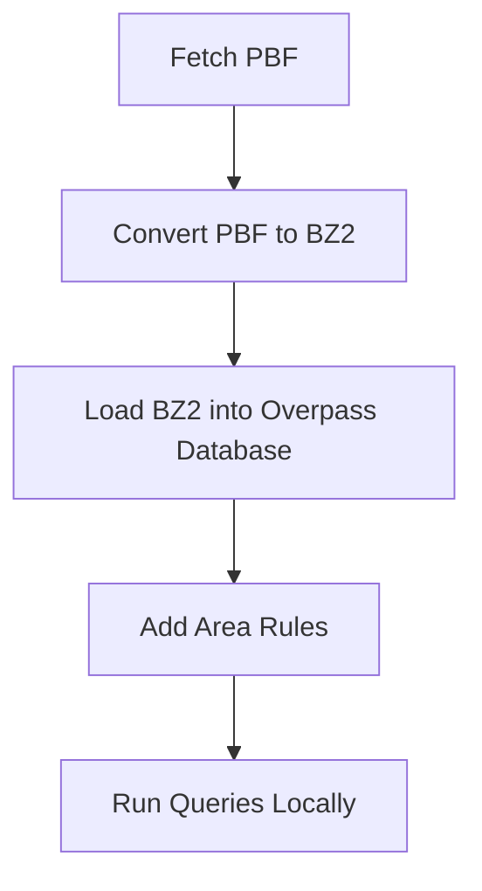

# overpass-immu-docker

This is a specialized Docker container for querying OSM using Overpass.
This project enables local querying of OpenStreetMap (OSM) data using the Overpass API, eliminating the need to rely on public Overpass API servers.

OSM data is obtained as `.pbf` files and converted into the Overpass database format, after which queries can be executed entirely on the local machine.

OSM data and database files are managed on the host filesystem and exposed to the container via Docker volumes, keeping the container itself stateless and immutable — the origin of the name `overpass-immu-docker`.

Note: this project does not include an OSM data update mechanism. For use cases requiring continuous data updates, an alternative solution is recommended.

## Architecture

No database files are stored within the Docker container. Instead, all OSM data and Overpass database files reside on the host filesystem and are made available to the container via Docker volumes.

All tooling required for data conversion and querying is bundled within the container, so no additional software needs to be installed on the host system.

This container does not include an OSM data update mechanism. For use cases requiring continuous updates, a purpose-built solution such as an Overpass API server with replication support is recommended.

The primary use case is executing local Overpass queries against OSM data, without depending on public Overpass API servers.

## Pipeline Run

Run the shell script:

```bash
./run-loader.sh <country> <region>
```

The `<country>` and `<region>` parameters correspond to the region identifiers used on the Geofabrik download site.

The script downloads the `.pbf` file from Geofabrik and executes the full ingestion pipeline: converting the `.pbf` to a `.bz2` file and then loading it into the Overpass API database format. Upon successful completion, the `db` folder — mounted via Docker volumes — will contain the database files ready for Overpass queries.

## Run Query

If you want to run a local query on the database you have created with the Pipeline Run above, enter the following command:

```bash
docker run --rm -it -v ./:/opt/op tderflinger/overpass-immu-docker /opt/op/binaries/osm3s_query --db-dir=/opt/op/db
```

You can then enter the Overpass Query in the terminal input field.

## Pipeline Overview

This diagram illustrates the process of loading OSM data and then querying it
with Overpass.



## Build Docker Container

If you want to create the Docker image locally, run:

```bash
docker build -t overpass-immu-docker .
```

## References

- Overpass API: https://github.com/drolbr/Overpass-API

- Setting up an Overpass API server - how hard can it be: https://www.openstreetmap.org/user/SomeoneElse/diary/408252


## License

This repository as such is licensed as MIT.

It contains the following applications licensed as AGPL-3.0:  `binaries/osm3s_query` and `binaries/update_database` and `rules/areas.osm3s` from [Overpass API](https://github.com/drolbr/Overpass-API).
